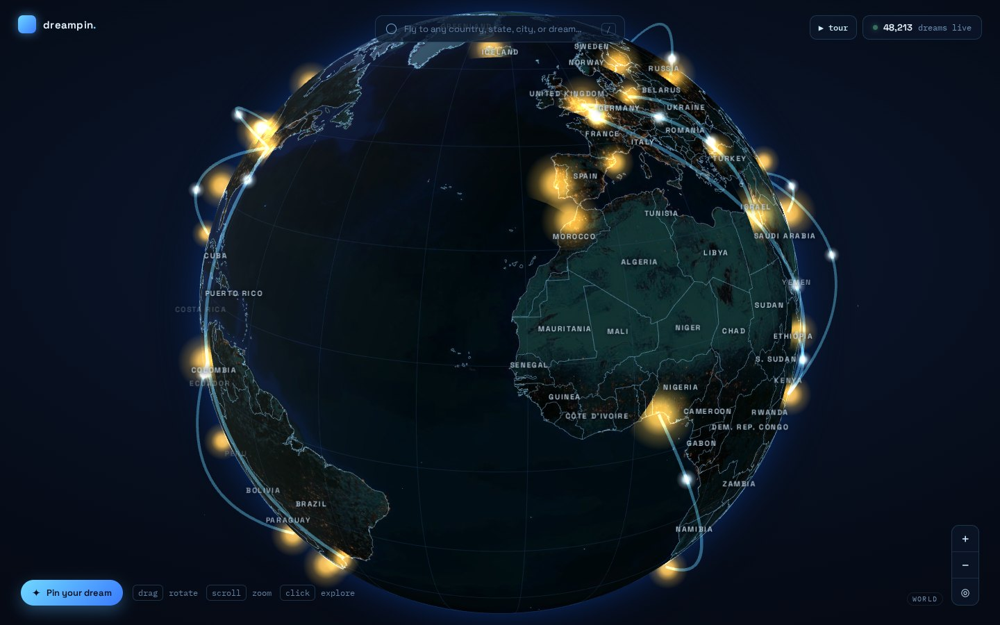
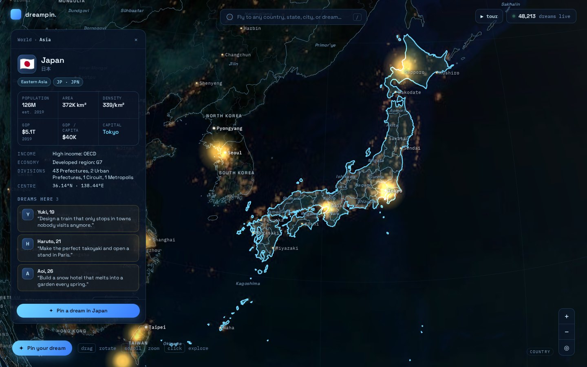
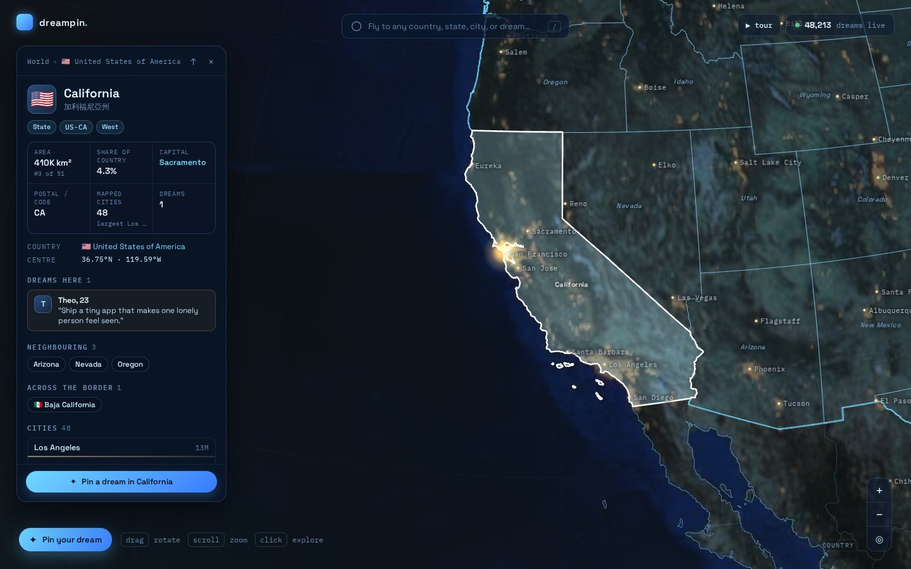
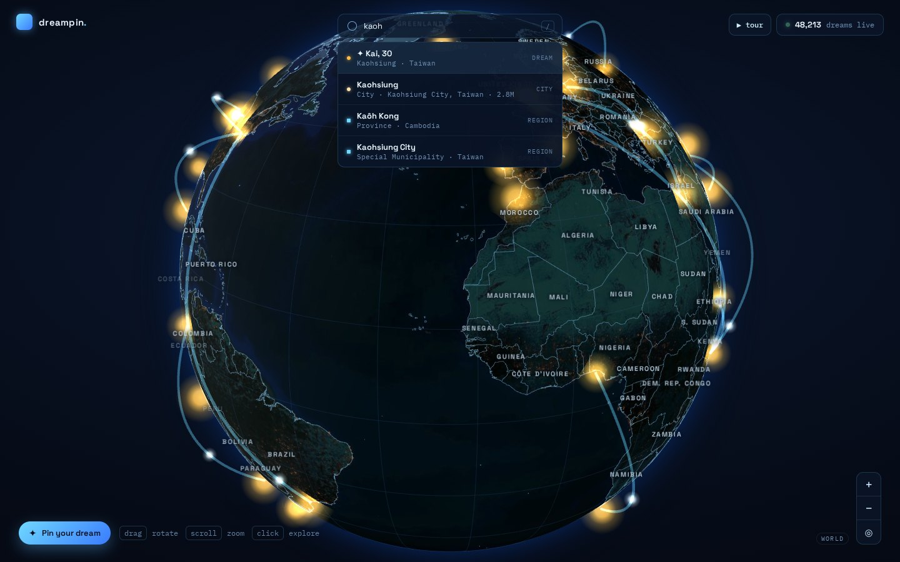
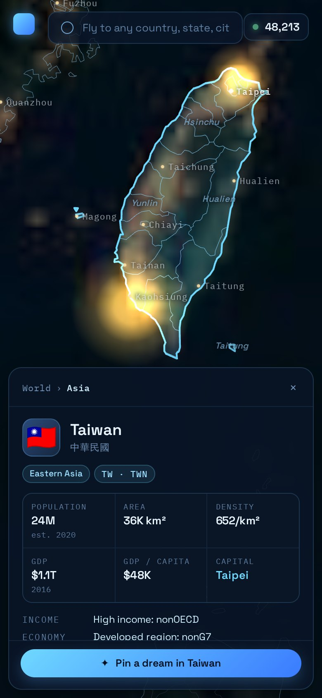

# dreampin. — Dream Globe

An interactive 3D night-Earth globe (React + Three.js). People pin their dreams at real
places; glowing markers, animated arcs, and a fully explorable map of **every country and
every state / province on Earth**.

**Live demo:** https://shueny.github.io/dream-globe/



| Country: Japan and its 47 prefectures | State: California |
| --- | --- |
|  |  |

| Search: dreams, cities, states | Mobile: bottom-sheet panel |
| --- | --- |
|  |  |

## Features

- **Every country (258) and state / province (4,596)** from Natural Earth 1:10m, drawn as
  crisp borders that follow the sphere. Country borders and coastlines always show; state
  and province borders fade in as you zoom.
- **Hover & click anything** — ray–sphere hit → lat/lng → point-in-polygon picking. Hover
  highlights the country (or the state, once you're inside a selected country or zoomed
  in); click to select it and fly there, framed to fit.
- **Region panel** for each country: flag, local name, population, area, density, GDP,
  GDP per capita, capital, income group, subdivision breakdown ("47 Prefectures"),
  bordering countries, filterable list of all its states, largest cities, dreams there.
- **Region panel** for each state / province: type, ISO 3166-2 code, postal code, area
  and rank within the country, share of the country, capital, cities inside it
  (point-in-polygon), neighbouring states, cross-border neighbours, dreams there.
- **Zoom-aware labels** for countries, states and ~7k cities (Natural Earth `min_label` /
  `scalerank`), with collision avoidance and a stable set while you rotate.
- **Search** across dreams, countries, states (English, local and Chinese names, ISO
  codes) and cities — offline — plus Open-Meteo geocoding for anywhere else (shows local
  time and elevation). Arrow keys + Enter; press `/` to focus.
- **Pin your dream** anywhere; the modal tells you which state and country you're in.
- **Guided tour** (`▶ tour`) for demos, **deep links** (`#/JPN`, `#/USA-3521`), `Esc` to
  go back up a level, and a mobile layout with bottom sheets.

## Run

```bash
pnpm install
pnpm dev        # http://localhost:5173
pnpm build      # static site in dist/ (relative base — deploy to any sub-path)
pnpm lint
pnpm test:unit  # Vitest (geo math, search, 3D layer builders) — add --coverage
pnpm test:e2e   # Playwright against the production build
```

Every push to `main` is deployed to GitHub Pages by `.github/workflows/deploy.yml`
(lint + unit tests + build, then publish `dist/`). One-time setup: repository
**Settings → Pages → Source: GitHub Actions**.

CI (`.github/workflows/ci.yml`) runs lint, unit tests with coverage, build and E2E on
every pull request; the `CI Passed` check aggregates them for branch protection.

## Geo data

`public/geo/` is generated from [Natural Earth](https://www.naturalearthdata.com) (public
domain) and committed, so builds never need the network:

```bash
pnpm build:geo  # downloads the 1:10m sources, simplifies to ~1.5 km, writes public/geo/
```

- `world.topo.json` — countries + states in one TopoJSON topology (shared arcs, so
  borders line up exactly). ~3.9 MB, ~1.2 MB gzipped.
- `places.json` — populated places as compact rows.

## Structure

```
src/
  DreamGlobe.jsx        React shell: state, selection, overlays
  globe/scene.js        Pure Three.js scene (camera, picking, highlights, fly-to)
  globe/geoLayers.js    Border lines, region fill triangulation, fat outlines
  globe/labels.js       DOM label layout (zoom filtering + collision)
  geo/data.js           Topology decode, point-in-polygon, areas, neighbours
  ui/                   Search, region panel
  data/dreams.js        Sample dreams (swap for a Supabase query here)
scripts/build-geo.mjs   Natural Earth → public/geo
```

## Public API

```js
DreamGlobe.addMarker(lat, lng, data)   // data: {name, age, city, country, text, tier, ago}
DreamGlobe.flyTo(lat, lng)
DreamGlobe.onMarkerClick(cb)           // cb(dream)
```

Available on `window.DreamGlobe` and via a React ref on `<DreamGlobe />`.
